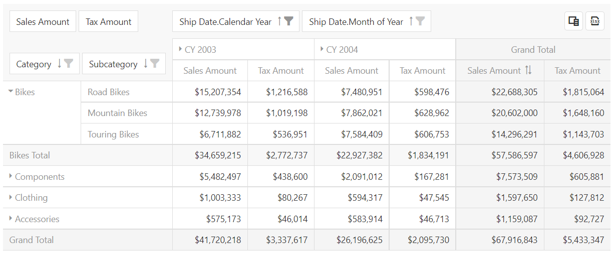

<!-- default badges list -->

<!-- default badges end -->
# DevExtreme PivotGrid - Getting Started

This repository stores the code examples of the PivotGrid component for the [Getting Started with PivotGrid](https://js.devexpress.com/Documentation/Guide/UI_Components/PivotGrid/Getting_Started_with_PivotGrid/) tutorial. This tutorial shows how to add the PivotGrid component to a page, bind the component to data, sort and filter data, and enable export to Excel.

## Files to Review

- **Angular**
    - [app.component.html](Angular/src/app/app.component.html)
    - [app.component.ts](Angular/src/app/app.component.ts)
- **jQuery**
    - [index.js](jQuery/src/index.js)
- **React**
    - [App.js](React/src/App.js)
- **Vue**
    - [App.vue](Vue/src/App.vue)

## Documentation

- [Getting Started with PivotGrid](https://js.devexpress.com/Documentation/Guide/UI_Components/PivotGrid/Getting_Started_with_PivotGrid/)

- [PivotGrid - API Reference](https://js.devexpress.com/Documentation/ApiReference/UI_Components/dxPivotGrid/)
